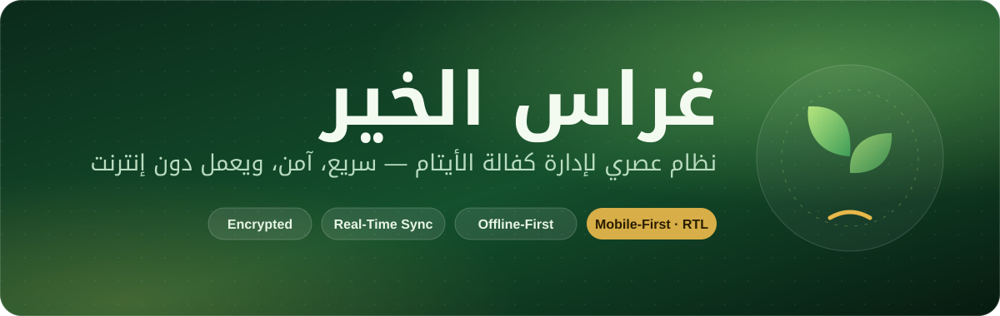
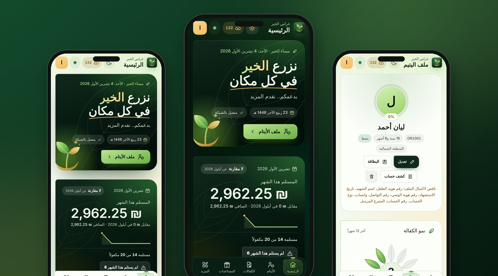
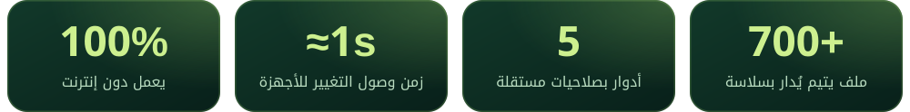
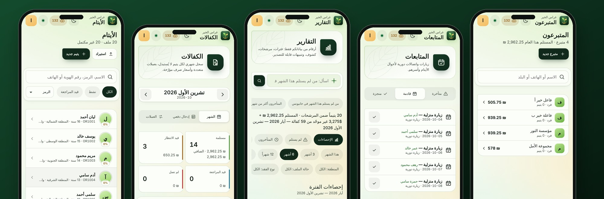

 

  

  

 

**غراس الخير** منظومة متكاملة تساعد الجمعيات الخيرية على رعاية الأيتام بتنظيم وشفافية: ملف لكل يتيم، وكفالات ومساعدات ومتابعات، وتقارير جاهزة، وفريق عمل بصلاحيات مضبوطة. صُمّمت للهاتف أولاً وبواجهة عربية كاملة من اليمين إلى اليسار، لتعمل في الميدان حيث الإنترنت ضعيف أو غائب، ثم تتزامن بين أجهزة الفريق فور عودة الاتصال.

 

 

<table>
<tr>
<td></td>
<td></td>
</tr>
<tr>
<td></td>
<td></td>
</tr>
<tr>
<td></td>
<td></td>
</tr>
<tr>
<td></td>
<td></td>
</tr>
</table>

 

 

الأيتام · الكفالات · التقارير · المتابعات · المتبرعون &nbsp;—&nbsp; بيانات تجريبية وهمية للعرض فقط

 

 

| الدور | يرى ويفعل |
|:--|:--|
| **المدير** | كل شيء: إدارة الحسابات والإعدادات والنسخ الاحتياطي وسجل التدقيق |
| **الموظف** | الأيتام والمتابعات والمساعدات والتسجيل ومراجعة الطلبات |
| **المحاسب** | الكفالات والمالية والمتبرعون والمشاريع والمصروفات والتقارير |
| **المشاهد** | اطّلاع فقط دون حذف أو تعديل |
| **اليتيم** | ملفه الخاص فقط، مع إمكانية رفع طلب تعديل لإدارة الجمعية |

 

 

- **تشفير على الجهاز:** الحقول الحساسة مثل أرقام الهويات والمحافظ تُشفَّر قبل تخزينها أو مزامنتها.
- **صلاحيات على كل طبقة:** تُفرض في الواجهة وفي الخادم وفي قاعدة البيانات، فلا يرى أحد إلا ما يخصّه.
- **سجل تدقيق** لكل عملية حسّاسة، وسلة محذوفات قابلة للاسترجاع.
- **جلسات قابلة للإبطال فوراً** عند إيقاف الحساب أو حذفه أو تصفير كلمة المرور.
- **خصوصية اليتيم أولاً:** حساب اليتيم لا يعرض اسم المتبرع ولا أي بيانات مالية.

 

 

| الطبقة | التقنية |
|:--|:--|
| الواجهة | HTML5 · CSS3 (متغيرات، حاويات، انتقالات) · JavaScript |
| التخزين المحلي | IndexedDB مع ترحيل تلقائي للإصدارات |
| الأداء | قائمة افتراضية لمئات الملفات · Web Workers للمهام الثقيلة |
| التطبيق | PWA قابل للتثبيت · حزمة أندرويد |
| التشفير | Web Crypto API |
| الصور | قبول كل الصيغ الشائعة (JPG · PNG · WebP · GIF · AVIF · HEIC) مع ضغط تلقائي |

 

صُنع بعناية لخدمة الأيتام وأسرهم

**ساجد العبادلة** &nbsp;·&nbsp; [@Dev-saged](https://github.com/Dev-saged)

